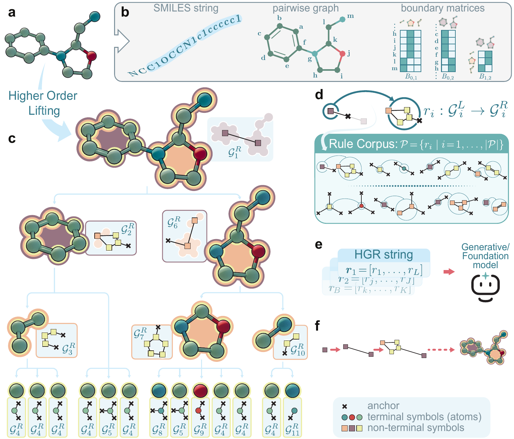

# HGR: Higher-Order Molecular Grammars for Generative and Foundation Models in Chemistry

This repository contains the official implementation of HGR.

Yiming Huang, Yujie Zeng, Vijay Prakash Dwivedi, Simone Foti, Jianmin Wang,
Jure Leskovec and Tolga Birdal

[🌐 Project page](https://circle-group.github.io/research/HGR-page/)

<p align="center">
  
</p>

<p align="center"><em>Figure 1. HGR lifts a molecular graph into a combinatorial complex, induces reusable production rules, serializes them as an HGR string, and reconstructs the molecule by reverse derivation.</em></p>

HGR turns hierarchical molecular topology into a sequence of grammar production
rules. Rings and motifs become explicit higher-order structures in a
combinatorial complex, while the resulting rule sequence remains compatible
with standard sequence models. The same representation is used for molecular
generation and transferable property prediction.

## Code

| Component | Purpose | Main entry point |
|---|---|---|
| HGR grammar | Construct MIG or RSG grammars and reconstruct molecules | `scripts/construct_grammar.py` |
| HGR-VAE | Learn a continuous latent space over grammar-rule sequences | `scripts/gvae_train.py` |
| HGR-LDF | Generate molecules by diffusion in the HGR-VAE latent space | `scripts/main_diff.py` |
| HGR-FM | Pretrain and transfer a grammar-based molecular encoder | `scripts/fm_pretrain.py`, `scripts/fm_finetune.py` |
| RingDiv | Evaluate generation on ring-enriched molecular data | `ringdiv/` |

## Installation

Create a Python environment, then install HGR and the RingDiv evaluation
package in editable mode:

```bash
python -m pip install -e .
python -m pip install -e ringdiv/
```

## Data and reproducibility

**RingDiv** is curated from approximately 143 million candidate compounds to
cover diverse ring topologies, including spiro, fused, and bridged systems.
RingDiv contains 1,183,434 molecules; **RingDiv300k** contains 299,819 molecules
and is used in the generation experiments.

RingDiv and RingDiv300k will be publicly available upon publication. Obtain
third-party benchmarks from the original sources cited in the paper.
Raw datasets are not included in this repository.

See [datasets/README.md](datasets/README.md) for benchmark sources, expected
file locations, split conventions, and grammar/FM preparation commands.
Third-party benchmarks remain subject to their original licenses and terms.

Run from the repository root:

```bash
export ASSET_ROOT="$PWD"
export WANDB_MODE=disabled
```

Vocabulary inputs are included in `configs/vocab/`. Build grammar artifacts
and train model checkpoints using the commands below. See
[datasets/README.md](datasets/README.md#rebuilding-grammar-artifacts) for
rebuilding instructions and validation scope.

## Running generation experiments

🧪 We provide generated molecules in [`results/`](results/).

Paper configurations are grouped by dataset under `configs/`. Commands below
use repository-relative config paths.

```bash
# Build a grammar and train HGR-VAE
python scripts/construct_grammar.py --config configs/qm9/gvae_rsg.yaml \
  --output-config "$ASSET_ROOT/rebuilt-configs/qm9-gvae.yaml"
python scripts/gvae_train.py --config "$ASSET_ROOT/rebuilt-configs/qm9-gvae.yaml"

# Sample from a trained HGR-VAE
python scripts/gvae_sample.py \
  --config "$ASSET_ROOT/rebuilt-configs/qm9-gvae.yaml" \
  --ckpt /path/to/gvae_checkpoint.pth

# Train and sample from HGR-LDF (first configure grammar and GVAE paths)
python scripts/main_diff.py \
  --config configs/zinc250k/diff_rsg.yaml \
  --mode train
python scripts/main_diff.py \
  --config configs/zinc250k/diff_rsg.yaml \
  --mode sample \
  --ckpt /path/to/diffusion_checkpoint.pt

# Evaluate generated molecules
python scripts/eval_gen_rel.py \
  --config configs/qm9/gvae_rsg.yaml \
  --smi_path /path/to/generated.smi
```

For HGR-LDF, first rebuild the matching dataset grammar and train its GVAE.
Set `path.grammar_path` and `path.gvae_ckpt_path` in your diffusion config
to those artifacts before running the commands above.

Final generation configs are available for QM9, ZINC250k, RingDiv300k, MOSES
and GuacaMol.

## Running foundation-model experiments

Prepare the FM data and generated configuration as described in `datasets/README.md`
before training. Downstream fine-tuning additionally requires a trained FM checkpoint:

```bash
python scripts/fm_pretrain.py --config "$ASSET_ROOT/rebuilt-configs/zinc2m-fm.yaml"
python scripts/fm_finetune.py --config configs/finetune.yaml
```

The downstream config performs full fine-tuning by default. To evaluate with
frozen-encoder probing, add `--ft-type freeze`.

## Configuration and assets

Every `--config` argument accepts either an absolute path or a path beginning
with `configs/`, resolved from the repository root. Checkpoint arguments accept
absolute paths or paths relative to `$CKPT_ROOT`, which defaults to
`$ASSET_ROOT/checkpoints`.

Set machine-specific paths through `ASSET_ROOT` and optional service settings
such as `WANDB_ENTITY` through environment variables.
